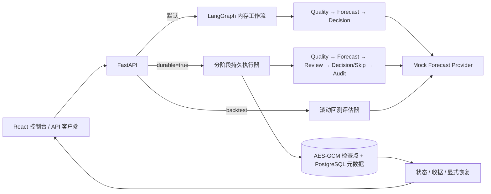

# GridCast-Agent

多智能体负荷预测工程公开示例

面向园区及售电侧的电力负荷预测与现货辅助决策场景。天气、节假日、新能源出力和用能行为变化会改变负荷曲线；固定预测模型难以在所有工况下保持稳定，日前预测偏差还可能影响实时结算。完整项目围绕“预测—验证—决策—反馈”组织数据治理、模型选择、滚动预测、风险分析和辅助决策。

**本仓库是可独立运行的公开工程切片。** 它展示多 Agent 的结构化协作、可替换的预测接口、加密持久状态、同机跨进程恢复、滚动回测、执行轨迹和 Web 控制台。API 只使用重复最后一个观测值的 Mock 预测器；另提供两个未训练的 PyTorch 基线参考实现供离线阅读和实验。公开版不包含 MPWNet 实现或权重、业务数据、市场规则知识库、优化策略和生产服务配置。页面中的数值与“决策”节点均不可用于交易、负荷申报或设备控制。

## 项目定位与公开边界

| 方向 | 完整项目的业务设计 | 本仓库可运行内容 |
| --- | --- | --- |
| 负荷预测 | 日前曲线、日内/实时滚动修正，按数据条件选择候选模型 | 结构化请求、Mock 点预测、离线 PatchTST/FTMixer 参考实现 |
| 多 Agent | 数据质量、上下文、预测协调、验证、市场辅助决策 | 确定性的质量、预测、评审、决策适配/跳过、审计阶段 |
| 记忆与恢复 | 按站点和工况沉淀模型表现，追踪任务生命周期 | 单任务检查点与有限协作消息；无跨任务模型表现记忆 |
| 市场知识与优化 | 规则检索、偏差风险、储能与柔性负荷建议 | 决策适配接口；未配置时明确跳过 |
| 前端 | 完整业务看板和运维界面 | 与公开 API 对接的预测、回测、状态、恢复和架构说明页面 |
| 模型评估 | 滚动回测和多模型表现比较 | 单个 Mock Provider 的逐折误差与防泄漏检查 |

这一区分也适用于下面的模型和系统说明：MPWNet 原理描述的是研究方向，**不是**公开仓库内可调用的模型能力；两个公开基线没有训练权重，也未接入 API。完整平台蓝图**不是**公开版的功能清单。

## 公开版运行逻辑



持久链路中的 Agent 是有固定输入、输出和路由规则的**确定性处理器**，不是自治 LLM Agent。质量阶段检查输入；预测阶段调用 Provider；评审阶段只验证输出长度和有限数值，最多允许一次修订；决策适配器未配置时返回 `skipped`；审计阶段记录有限执行元数据。评审通过不代表预测准确。Agent 消息只保留消息 ID、阶段、次数、固定结论/原因码和时间，不返回历史负荷或预测值。更细的执行与存储设计见 [架构文档](docs/architecture.md)。

默认内存路径保持简短，用于体验 API 和 LangGraph；持久路径专门演示阶段提交、消息、租约、fencing token 和显式恢复。两条路径共用公开的 Provider 契约，但并不声称具备生产级调度、自动恢复或高可用。

## 研究模型：MPWNet 的工作思路

完整项目研究多周期与非平稳负荷序列的长期预测。MPWNet 的主要思路如下，**仅介绍原理，不提供实现、参数、权重或训练数据**：

1. 结合自相关分析与周期先验，选取候选主导周期，为各周期建立可学习的周期模式矩阵。
2. 从输入中显式分离周期成分，对剩余残差进行一级离散小波分解，以低频分支建模较平滑的趋势，以高频分支建模局部波动。
3. 重构低、高频预测残差并叠加未来周期表示，再以可学习权重融合多个周期分支。
4. 在输入和输出侧使用 RevIN，缓解不同时间窗口统计分布变化的影响。

MPWNet 输出**点预测**。完整系统讨论的 P10/P50/P90 区间需要另设校准或概率预测环节，不是该模型原生输出，也未在本仓库实现。实际模型选择还需结合变量维度、样本规模、预测跨度、外生变量、回测表现及算力预算；公开版没有真实模型路由或精度对比数据，不对任何业务指标作效果承诺。

## 公开的基线参考模型

仓库另外提供独立编写的 `PatchTSTReference` 与 `FTMixerReference`。前者演示通道独立分块与共享 Transformer 编码；后者演示周期网格、FFT 频域分支及可学习融合。这些是**简化的教学参考实现**，并非原论文代码的复制或完整复现；不附带训练数据、训练脚本与权重，不会自动替换 API 的 Mock Provider。输入输出形状、差异、来源和可选安装方法见 [模型说明](docs/reference_models.md)。

## 技术组成

- **后端：** Python、FastAPI、Pydantic、LangGraph；Provider/Adapter 边界便于替换真实实现。
- **可选模型：** PyTorch 的 PatchTST/FTMixer 思路参考代码；不加载到公开服务。
- **持久执行：** PostgreSQL 存储有限元数据，AES-256-GCM 加密检查点，短事务、租约和 fencing token 控制阶段提交。
- **前端：** React、TypeScript、Vite；展示任务提交、Mock 曲线、Agent 轨迹、收据、检查点和显式恢复。
- **验证：** pytest、Ruff、前端 TypeScript/Vite 构建、固定文件白名单发布守卫、GitHub Actions。
- **评估示例：** 最近折滚动回测；计算 MAE、RMSE、WAPE、sMAPE，Provider 只接收截点前的观测。

仓库结构：

```text
frontend/                  公开 Web 控制台
src/gridcast_public/       API、契约、Provider、工作流与持久执行
src/gridcast_public/reference_models/  可选、未训练的两个基线
tests/                     API、工作流、存储与恢复测试
scripts/release_guard.py   发布文件白名单与敏感内容检查
scripts/prune_runtime.py   手动清理终态任务
docs/architecture.md       执行与恢复设计细节
docs/backtesting.md        回测方法、指标与限制
docs/reference_models.md   模型边界与使用说明
```

## 本地启动

需要 Python 3.11–3.13 和 Node.js 24。以下命令在仓库根目录执行；先启动 API，再启动前端。

先准备 PostgreSQL。下面的本地开发示例只绑定回环地址，使用免密认证；不要将这种认证方式用于对外服务。已创建过容器时可使用 `docker start gridcast-postgres-dev`，首次创建使用：

```bash
docker run --detach --name gridcast-postgres-dev --env POSTGRES_USER=gridcast_dev --env POSTGRES_DB=gridcast_dev --env POSTGRES_HOST_AUTH_METHOD=trust --publish 127.0.0.1:55432:5432 --volume gridcast-postgres-dev-data:/var/lib/postgresql/data postgres:16-alpine
```

数据库保存在 Docker 命名卷中，不属于 Git 仓库。实际环境应使用独立账号及受保护的凭证，连接信息通过环境变量注入。启动 API 的进程需要 `GRIDCAST_DATABASE_URL` 和随机的 `GRIDCAST_CHECKPOINT_KEY` 才能启用持久模式；初次启动会在指定 schema 中创建表，因此数据库账号需要相应权限。

**终端 1：API**

```bash
python -m venv .venv
# Windows PowerShell: .venv\Scripts\Activate.ps1
# macOS/Linux: source .venv/bin/activate
python -m pip install -e ".[dev]"
uvicorn gridcast_public.api:app --reload --host 127.0.0.1 --port 8000
```

此时可以运行进程内示例；要使用刚启动的 PostgreSQL 保存检查点，请按下方“启用加密持久执行”设置环境变量后再启动 API。

**终端 2：前端**

```bash
cd frontend
npm ci
npm run dev
```

打开 `http://127.0.0.1:5173/`。前端默认把 `/v1`、`/health` 和 `/docs` 代理到 `http://127.0.0.1:8000`；如果 API 使用其他端口，启动前在终端设置 `GRIDCAST_API_TARGET` 为 API 根地址。前端没有捆绑业务数据；可手动输入测试序列，也可在“滚动回测”页面即时生成合成示例。API 文档在 `http://127.0.0.1:8000/docs`。

可以直接通过 API 发起内存模式任务：

```bash
curl -X POST "http://127.0.0.1:8000/v1/workflows/run" \
  -H "Content-Type: application/json" \
  -d '{"site_id":"demo-site","history":[10,12,11,13],"horizon":3}'
```

响应中的 `forecast` 为 `[13,13,13]`，只证明请求和工作流已连通。默认内存收据有数量和时间上限，进程重启后会消失。

### 滚动回测实验室

前端“滚动回测”页面支持粘贴连续观测值、生成临时合成序列，并展示逐折与平均误差。也可以调用 `POST /v1/evaluations/backtest`；默认取最近最多 5 折，每折用截点前的全部历史预测后续 `horizon` 个点，截点间隔默认为 `horizon`。训练窗口最少需要 `max(8, 2 × horizon)` 个观测。示例请求：

```bash
curl -X POST "http://127.0.0.1:8000/v1/evaluations/backtest" \
  -H "Content-Type: application/json" \
  -d '{"history":[10,12,11,13,12,14,13,15,14,16,15,17],"horizon":2,"max_folds":2}'
```

该接口**只评估公开 Mock Provider**，不会加载 MPWNet、PatchTST 或 FTMixer；请求序列不写入数据库，响应只含截点、折数、MAE/RMSE/WAPE/sMAPE 和固定失败码，不返回逐点真实值或预测值。WAPE 在实际值绝对值之和接近零时为 `null`。这种回测演示切分和指标计算，不能证明实际模型效果。方法、指标口径及边界见 [回测说明](docs/backtesting.md)。

### 启用加密持久执行

只有显式指定 `durable=true` 才进入持久链路。请在**仓库外**生成并保存随机的 32 字节 Base64 密钥，将其作为 `GRIDCAST_CHECKPOINT_KEY` 注入 API 进程，并配置 `GRIDCAST_DATABASE_URL`。本地开发连接地址为 `postgresql://gridcast_dev@127.0.0.1:55432/gridcast_dev`；可用 `GRIDCAST_DB_SCHEMA` 指定已存在的 schema，默认 `public`。不要把密钥、连接凭证或真实负荷输入提交到 Git。生成密钥的示例：

```bash
python -c "import base64,secrets; print(base64.b64encode(secrets.token_bytes(32)).decode())"
```

以 Windows PowerShell 为例，先将生成的密钥安全注入当前终端，再启动或重启 API：

```powershell
$env:GRIDCAST_DATABASE_URL = "postgresql://gridcast_dev@127.0.0.1:55432/gridcast_dev"
$env:GRIDCAST_DB_SCHEMA = "public"
# 将随机 Base64 密钥通过本机安全方式设置为 GRIDCAST_CHECKPOINT_KEY
uvicorn gridcast_public.api:app --reload --host 127.0.0.1 --port 8000
```

前端的“加密持久执行”开关随后会启用；或者调用 `POST /v1/workflows/run?durable=true`。使用返回的 `request_id` 查询 `GET /v1/workflows/{request_id}`、`GET /v1/workflows/receipts/{request_id}`，需要继续执行时主动调用 `POST /v1/workflows/{request_id}/resume`。可选 `Idempotency-Key` 默认复用检查点密钥进行 HMAC；需要独立密钥时再设置 `GRIDCAST_IDEMPOTENCY_KEY`。

检查点在 PostgreSQL 事务中与阶段状态、协作消息一起提交。已提交阶段不会重做，但进程若在 Provider 返回后、阶段提交前退出，该阶段可能重新执行；这是 **at-least-once** 阶段执行，不保证外部副作用只发生一次。表中仍可见任务 ID、状态、阶段、时间、租约和加密载荷大小等有限元数据；密钥持有者可解密保留的状态。共享 PostgreSQL 可供多个进程连接，但示例不含后台自动恢复、身份认证或跨主机调度。密钥遗失或不匹配时不能恢复。终态任务没有自动 TTL；可按需运行：

```bash
python scripts/prune_runtime.py --days 30 --max-terminal-runs 1000
```

此前保存在本机旧存储中的任务不会自动导入 PostgreSQL；新版本只查询 PostgreSQL 中创建的持久任务。

## API 一览

| 方法与路径 | 用途 |
| --- | --- |
| `GET /health` | 服务和存储模式健康信息 |
| `GET /v1/capabilities` | 公开 Provider、存储及功能边界 |
| `POST /v1/evaluations/backtest` | 不持久化输入的滚动回测与逐折指标 |
| `POST /v1/workflows/run` | 内存执行；`?durable=true` 选择持久执行 |
| `GET /v1/workflows/receipts/{request_id}` | 查询有限执行收据 |
| `GET /v1/workflows/{request_id}` | 查询持久状态和安全协作消息 |
| `POST /v1/workflows/{request_id}/resume` | 显式从最近提交的阶段继续 |

请求字段为 `site_id`、至少两个有限数值的 `history` 和 `1–672` 的 `horizon`。具体约束和响应契约以 `/docs` 为准。公开前端只调用以上 API；不会请求私有市场、模型、任务队列或知识库服务。

## 验证与发布

在**干净的签出目录、安装依赖之前**先运行发布守卫，因为它会扫描所有文件，包括 Git 忽略的缓存、虚拟环境、构建产物和数据库：

```bash
python scripts/release_guard.py
python -m pip install -e ".[dev]"
python -m ruff check src tests scripts
python -m pytest -q
cd frontend
npm ci
npm run build
```

CI 会在依赖安装前运行守卫，再用 PostgreSQL 服务执行 Python 集成测试与前端构建；未安装可选 PyTorch 时模型测试会跳过。除上述两个独立参考实现外，MPWNet 与上游源码、训练实现、模型权重、数据集、规则语料、内部地址、业务优化代码、凭证和构建产物均不属于发布范围。许可和安全边界见 [LICENSE](LICENSE)、[SECURITY.md](SECURITY.md) 与 [公开发布清单](PUBLIC_RELEASE_MANIFEST.md)。
