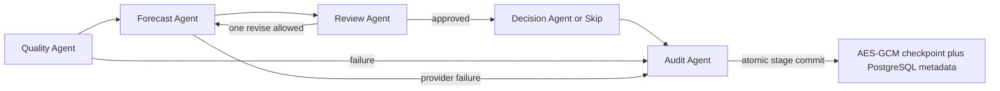

# Public Architecture

The original `POST /v1/workflows/run` path remains a single-process LangGraph example. Passing `?durable=true` opts into the independently staged coordinator:

Each agent is a separately routed handler with a fixed input/output boundary. Messages carry only IDs, stage, attempt, fixed verdict/reason code and time. Forecast values and request state stay in memory while a stage runs and are encrypted before they are persisted. Review checks the public output contract (length and finite numbers); it is not a quality evaluator. The one retry is a bounded correction opportunity, not an algorithmic improvement claim. These are deterministic example agents, not autonomous LLM agents.

## Durable execution

`DurableStore` connects to PostgreSQL through `GRIDCAST_DATABASE_URL`. A validated `GRIDCAST_DB_SCHEMA` selects the schema (default `public`); the configured role must be able to create tables on first startup. Every committed stage atomically writes an encrypted checkpoint, next stage, safe messages and metadata in one short transaction. AES-256-GCM gets its Base64 encoded 32-byte key from `GRIDCAST_CHECKPOINT_KEY`; AAD binds task ID, checkpoint version and schema version. Request body, site ID, cleaned history, candidates, forecasts, decisions and provider exceptions are never stored in PostgreSQL plaintext. Visible columns contain IDs, status, fixed stage/error codes, attempt, timestamps, checkpoint version, fencing and lease metadata.

PostgreSQL rows, logs and backups can expose these limited metadata fields and ciphertext sizes; checkpoint content remains encrypted. No credentials, connection URL, inputs or results are included in status APIs or normal errors. The key holder can decrypt retained checkpoint payloads. Operators need to protect the database, connection credentials, key, backups and retention policy.

Workers claim a time-limited lease through a conditional PostgreSQL row update and monotonically increasing fencing token. The executor renews during provider calls. Stage commits check the live owner/token/expiry and expected checkpoint version. If a lease expires, the old worker cannot write after another worker takes over. Completed stage effects are not repeated; if a process stops after a provider returns and before its stage commit, that stage runs again. This is at-least-once stage execution, not exactly-once provider execution.

Use `GET /v1/workflows/{request_id}` for safe status and messages and `POST /v1/workflows/{request_id}/resume` to continue from `next_stage`. Missing or wrong keys fail closed without clearing a checkpoint or falling back to the beginning. `Idempotency-Key` is optional; when supplied, keyed HMAC digests are stored to map a repeated identical request to its task ID. Without the header, a lost initial response may leave the caller without the generated ID.

The in-memory mode needs no key or database and still supports the legacy synchronous API. `/health` and `/v1/capabilities` report its mode and that recovery is unavailable. There is no startup scan or background worker. Durable rows are not automatically expired; operators can run `python scripts/prune_runtime.py --days 30 --max-terminal-runs 1000` on a schedule to trim terminal tasks; PostgreSQL foreign keys cascade to messages and idempotency mappings. Running and recoverable tasks are always retained. Shared PostgreSQL allows distinct processes to access a request, but this example has no high-availability queue or automatic work distribution. It stores process state and collaboration history for one request, not cross-request user memory, a RAG store, or authentication.

The included forecast provider repeats the last input value only to demonstrate wiring. Private models, data, optimization logic, market rules, and service configuration are excluded.

## Public backtest boundary

`POST /v1/evaluations/backtest` runs independently of durable workflow execution. It picks recent rolling cutoffs and invokes the configured public Mock Provider with a copy of observations strictly before each cutoff. The held-out horizon is used only after prediction for metric calculation. It returns fold counts, cutoffs, MAE, RMSE, WAPE and sMAPE, but no input series, predictions or observed holdout values. Provider exceptions are converted to a fixed failure code. The endpoint does not write to PostgreSQL or the receipt store. See [backtesting](backtesting.md) for formulas and limitations. It is an evaluation harness, not the complete project's model router or performance memory.
